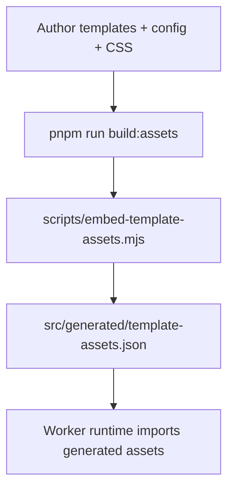
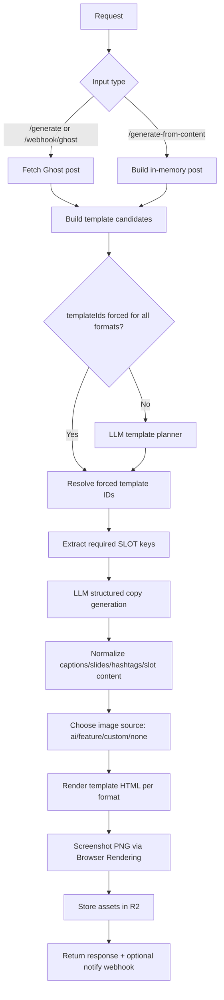
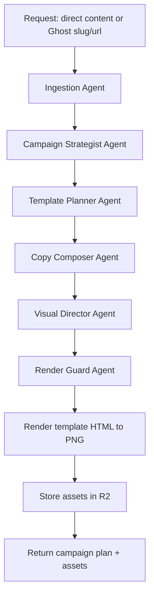

# Architecture

This document describes the current runtime architecture (as of March 6, 2026) and a proposed evolution to a Cloudflare Agents-based orchestration model.

## Build-Time Flow

`pnpm run build:assets`:

1. loads and merges `config/pipeline.config.yaml` + fragments
2. discovers templates from `templates/*.html` and system templates
3. validates format defaults and template compatibility
4. embeds compiled CSS and template HTML into generated JSON

## Runtime Components

- `src/index.ts`: routes, validation, orchestration
- `src/ai.ts`: template planner + structured copy generation + normalization
- `src/templates.ts`: template resolution, slot extraction, HTML assembly
- Cloudflare Workers AI (`AI`)
- Cloudflare Browser Rendering (`BROWSER`)
- Cloudflare R2 (`OUTPUT_BUCKET`)

## Active Routes

- `GET /health`
- `GET /template/<format>`
- `GET /preview/screenshot?format=...&templateId=...`
- `POST /generate`
- `POST /generate-from-content`
- `POST /webhook/ghost`

## Current AI-Orchestrated Flow

## Template Dependency Model

Templates define dynamic slot contracts through `{{SLOT:key}}`. Runtime behavior:

1. selected template IDs determine required slot keys
2. required keys are enforced in LLM JSON schema
3. slot output is normalized and bounded
4. request `slotOverrides` can override generated slot values
5. final rendering still applies fallback slot inference for safety

Because slot keys vary by template, text generation and template selection are tightly coupled in the current architecture.

## Image Selection Flow

`image.mode` controls selection:

- `custom`: use `image.customUrl`
- `feature`: use source post feature image
- `ai`: force AI image generation (if enabled)
- `none`: no image
- `auto`: try AI first (if enabled), then feature fallbacks

## Proposed Agentic Flow (Design)

The goal is to evolve the current pipeline into an agentic orchestration system on Cloudflare Agents, with centralized behavior prompts and role-based sub-agents.

Recommended Cloudflare implementation model:

- root `MarketingOrchestratorAgent` (extends `AIChatAgent`) handles the request/session
- role sub-agents implemented as callable methods and/or dedicated Agent instances
- long-running or approval-heavy tasks delegated to `AgentWorkflow`
- campaign memory persisted in Agent state + embedded SQLite per instance
- progress and partial outputs streamed over WebSockets/SSE when needed

Central prompt control (design):

- maintain one central prompt registry in config
- each role prompt inherits from the central master prompt
- runtime `llm` overrides append role-specific controls without duplicating policy text

## Platform Strategy (Planned)

- Instagram feed: portrait/square variants
- Instagram carousel: intro, middle, ending slides planned by strategist agent
- Instagram story: short, CTA-forward sequence planned separately from feed
- Facebook: mapped from Instagram strategy/assets with platform-native copy adaptation
- LinkedIn and X/Twitter: unique post variants, not resized duplicates

## Content and Render Guardrails (Planned)

- enforce "no typography in AI-generated backgrounds" in visual prompts
- if markdown-like syntax appears in visual slots, either:
- render it properly (Markdown -> HTML)
- or normalize to plain text before overlay
- support math rendering (`$...$`, `$$...$$`) via KaTeX/MathJax pre-render
- support diagram rendering via Mermaid-to-SVG pre-render
- preflight text-fit checks per slot:
- estimate line-wrap and bounding boxes
- adjust font-size/line-height or switch template variant
- reject/post-process outputs that would overflow or hide text
- avoid mid-sentence truncation via completion-aware clipping and sentence-boundary rules

## Cloudflare Research Notes

Design choices above align with Cloudflare Agents capabilities:

- Agents are stateful and built on Durable Objects
- each instance is globally unique and can be routed back to preserve context
- lifecycle hooks (`onStart`, `onRequest`, `onMessage`, etc.) support request + realtime orchestration
- AI models can be called from request handlers, websocket handlers, scheduled tasks, and custom methods
- Agents + Workflows are recommended for long-running, retryable, multi-step tasks
- MCP client support enables external tool ecosystems with OAuth-capable connection handling

References:

- https://developers.cloudflare.com/agents/
- https://developers.cloudflare.com/agents/api-reference/agents-api/
- https://developers.cloudflare.com/agents/api-reference/using-ai-models/
- https://developers.cloudflare.com/agents/concepts/workflows/
- https://developers.cloudflare.com/agents/api-reference/mcp-client/
