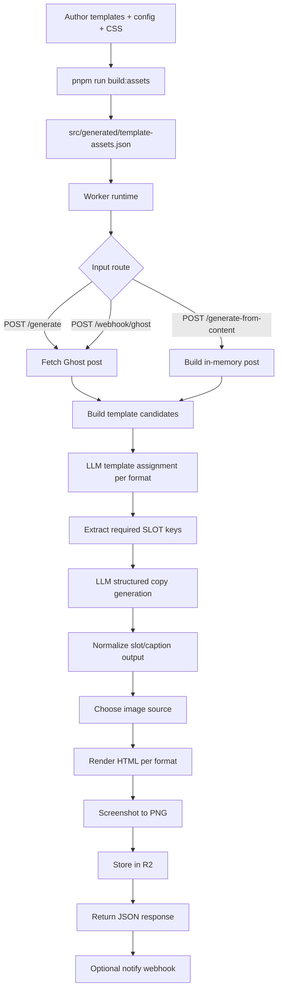

# Architecture

This document describes how the pipeline works from input content to final PNG assets.

## High-Level Flow

## Build-Time System

`pnpm run build:assets` runs `scripts/embed-template-assets.mjs`, which:

1. Loads and merges config from `config/pipeline.config.yaml` and fragments.
2. Validates template registry and format defaults.
3. Loads all `templates/*.html` and `templates/system/*.html`.
4. Builds `src/styles/template.css` into `src/generated/template.css`, then embeds that compiled stylesheet.
5. Emits `src/generated/template-assets.json`.

`src/generated/template-assets.ts` is a typed wrapper around that JSON.

## Runtime Components

- `src/index.ts`: routes, request validation, orchestration
- `src/ai.ts`: template planner + structured content generation
- `src/templates.ts`: template resolution, slot extraction, HTML assembly
- `src/template-theme.ts`: brand token derivation and render controls
- Cloudflare Workers AI (`AI`)
- Cloudflare Browser Rendering (`BROWSER`)
- Cloudflare R2 (`OUTPUT_BUCKET`)

## Route Layers

- `GET /health`
- `GET /template/<format>` preview renderer
- `GET /template-catalog` template and format catalog
- `POST /generate` Ghost-backed generation
- `POST /generate-from-content` direct-content generation
- `POST /webhook/ghost` webhook-triggered generation

## Template and Slot Model

Templates are pure skeletons with placeholders:

- regular tokens like `{{HEADING}}`, `{{BODY}}`, `{{HEADER}}`
- slot tokens like `{{SLOT:headline}}`, `{{SLOT:metric_value}}`

For selected templates, the runtime computes `required_slot_keys` by scanning `{{SLOT:key}}` placeholders. That list is enforced in the LLM JSON schema.

## Template Selection

Per requested format:

1. If request provides `templateIds[format]`, that is used.
2. Otherwise `chooseTemplateAssignments` asks the LLM to pick from current candidate template IDs only.
3. Runtime validates selected ID and falls back to format default if needed.

This keeps selection dynamic and aligned with whatever templates are currently registered.

## Design System Boundaries

- CSS source of truth: `src/styles/template.css` (compiled output: `src/generated/template.css`)
- Shared wrappers: `templates/system/head-shell.html` and `templates/system/frame-shell.html`
- Optional shared fragments (top bar, kicker, footer): `templates/system/*.html`
- Brand/design overrides are injected as CSS variables and render controls

No runtime style CDN/script injection and no full HTML layouts are hardcoded inside TypeScript modules.

## Image Source Selection

Runtime chooses image source by mode/settings and availability:

- `custom`
- `feature`
- `stock` (if enabled + key available)
- `ai` (if enabled)
- `none`

`auto` mode follows configured preferences and fallbacks.

## Asset Rendering and Storage

- HTML is rendered using Browser Rendering (Puppeteer) at format dimensions.
- PNG assets are uploaded to R2.
- Storage path is derived from `storage` config and request overrides.
- `output.postCount > 1` produces `variants[]` with versioned storage behavior for non-primary variants.

## Determinism and Safety

- No filesystem reads at Worker runtime.
- Request limits and security controls enforced from config.
- LLM output is normalized and bounded by generation limits.
- Missing fields fallback to safe defaults so rendering still succeeds.
