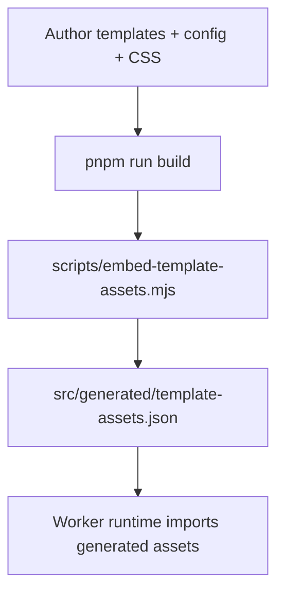
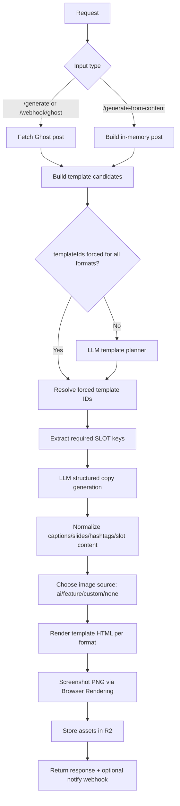

# Architecture

This document describes the current runtime architecture (as of March 6, 2026), including the Cloudflare Agents SDK orchestration path.

## Build-Time Flow



`pnpm run build`:

1. loads and merges `config/pipeline.config.yaml` + fragments
2. discovers templates from `templates/*.html` and system templates
3. validates format defaults and template compatibility
4. embeds compiled CSS and template HTML into generated JSON

## Runtime Components

- `src/index.ts`: routes, validation, orchestration
- `src/ai.ts`: template planner + structured copy generation + normalization
- `src/agents/marketing-orchestrator.ts`: Cloudflare Agent (Durable Object) that creates strategic briefs and role guidance
- `src/templates.ts`: template resolution, slot extraction, HTML assembly
- Cloudflare Workers AI (`AI`)
- Cloudflare Browser Rendering (`BROWSER`)
- Cloudflare R2 (`OUTPUT_BUCKET`)
- Cloudflare Agents SDK Durable Object binding (`MARKETING_ORCHESTRATOR`)

## Active Routes

- `GET /health`
- `GET /template/<format>`
- `GET /preview/screenshot?format=...&templateId=...`
- `POST /generate`
- `POST /generate-from-content`
- `POST /webhook/ghost`

## Current AI-Orchestrated Flow



## Agentic SDK Flow (Implemented)

When `agent.mode` resolves to `agentic` (default from config), runtime invokes the `MarketingOrchestratorAgent` before template/copy generation.

```mermaid
flowchart TD
    A[POST /generate or /generate-from-content] --> B[Resolve agent mode/profile/policy]
    B --> C{mode == agentic?}
    C -->|No (reserved)| D[Use profile-only agentic defaults]
    C -->|Yes| E[Call MARKETING_ORCHESTRATOR Durable Object]
    E --> F[Receive strategic_brief + planner/copy/visual notes]
    F --> G[Apply planner overrides in template selection]
    G --> H[Apply copy overrides in structured generation]
    H --> I[Apply render policy guardrails to slot/carousel/image prompt]
    I --> J[Render + R2 store + response]
```

If the Durable Object binding is missing or orchestration fails, runtime keeps agentic defaults from the central prompt profile and emits `agentic.warnings`.

## Template Dependency Model

Templates define dynamic slot contracts through `{{SLOT:key}}`. Runtime behavior:

1. selected template IDs determine required slot keys
2. required keys are enforced in LLM JSON schema
3. slot output is normalized and bounded
4. request `slotOverrides` can override generated slot values
5. final rendering still applies fallback slot inference for safety

Because slot keys vary by template, text generation and template selection are tightly coupled in the current architecture.

## Image Selection Flow

`image.mode` controls selection:

- `custom`: use `image.customUrl`
- `feature`: use source post feature image
- `ai`: force AI image generation (if enabled)
- `none`: no image
- `auto`: try AI first (if enabled), then feature fallbacks

## Central Prompt System (Implemented)

Prompt control is centralized in `config/pipeline/content.yaml` under:

- `generation.agents.default_mode`
- `generation.agents.default_prompt_profile`
- `generation.agents.prompt_profiles.<profile>.mastermind`
- `generation.agents.prompt_profiles.<profile>.roles.{strategist,template_planner,copywriter,visual_director,render_guard}`
- `generation.agents.render_policy`

Runtime behavior:

1. resolve prompt profile + render policy from config and request `agent` overrides
2. send profile + source content to `MarketingOrchestratorAgent`
3. merge orchestration outputs into planner/copy prompts
4. enforce render policy in postprocessing (hashtags in visual slots, markdown/math/diagram text sanitation, image no-text directive)

## Platform Strategy Scope

- Instagram feed: portrait/square variants
- Instagram carousel: intro, middle, ending slides planned by strategist agent
- Instagram story: short, CTA-forward sequence planned separately from feed
- LinkedIn and X/Twitter: unique post variants, not resized duplicates
- Facebook is not a first-class render format yet; reuse/export from existing rendered formats.

## Content and Render Guardrails

- enforce "no typography in AI-generated backgrounds" in visual prompts
- render markdown syntax in visual text via server-side `markdown-it`
- render math syntax (`$...$`, `$$...$$`) via server-side KaTeX (MathML output)
- render Mermaid fenced blocks via shell-side Mermaid runtime to SVG
- screenshot capture waits for `window.__RICH_RENDER_DONE__` to prevent half-rendered diagrams
- apply slot/content length bounds before render
- sanitize visual text according to render policy (hashtags/markdown/math/diagram rules)
- avoid mid-sentence truncation via completion-aware clipping and sentence-boundary rules

## Cloudflare Research Notes

Current implementation and next-step design choices align with Cloudflare Agents capabilities:

- Agents are stateful and built on Durable Objects
- each instance is globally unique and can be routed back to preserve context
- lifecycle hooks (`onStart`, `onRequest`, `onMessage`, etc.) support request + realtime orchestration
- AI models can be called from request handlers, websocket handlers, scheduled tasks, and custom methods
- Agents + Workflows are recommended for long-running, retryable, multi-step tasks
- MCP client support enables external tool ecosystems with OAuth-capable connection handling

References:

- https://developers.cloudflare.com/agents/
- https://developers.cloudflare.com/agents/api-reference/agents-api/
- https://developers.cloudflare.com/agents/api-reference/using-ai-models/
- https://developers.cloudflare.com/agents/concepts/workflows/
- https://developers.cloudflare.com/agents/api-reference/mcp-client/
