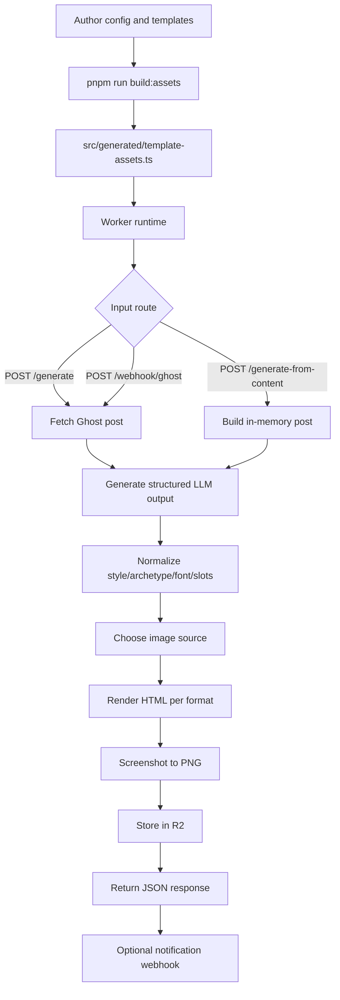

# Architecture

This document explains how requests move through the pipeline from source content to final PNG assets.

## High-Level Flow

## Build-Time Architecture

Build-time compilation keeps Worker runtime deterministic.

Inputs:

- `config/pipeline.config.yaml`
- `config/pipeline/templates.yaml`
- `config/pipeline/content.yaml`
- `config/pipeline/runtime.yaml`
- `templates/**/*.html`
- `src/styles/template.css`

Outputs:

- `src/generated/template-assets.ts`

Commands:

- `pnpm run build:templates`
- `pnpm run build:assets`

`build:templates` validates config and embeds templates + stylesheet for runtime rendering.

## Runtime Components

- `src/index.ts`: routes and orchestration
- `src/templates.ts`: template selection and interpolation
- `src/template-theme.ts`: theming, font, and visual controls
- Cloudflare Workers AI (`AI` binding)
- Cloudflare Browser Rendering (`BROWSER` binding)
- Cloudflare R2 (`OUTPUT_BUCKET` binding)

## Request Routes

- `GET /health`
- `GET /template/<format>` preview only
- `POST /generate` Ghost-backed generation
- `POST /generate-from-content` direct-content generation
- `POST /webhook/ghost` token-protected webhook trigger

## Pipeline Stages

### 1) Content ingestion

- `/generate`: resolves `slug` from body (`slug` or `url`) and fetches Ghost post
- `/generate-from-content`: creates internal post object from provided fields
- `/webhook/ghost`: extracts slug from webhook payload and fetches Ghost post

### 2) Structured copy generation

Worker sends prompt to Workers AI and expects strict JSON schema:

- social captions
- carousel slides
- hashtags
- image prompt
- slot content

### 3) Normalization and fallback

Worker normalizes and constrains model output using `generation.limits` and `generation.fallbacks`.

- caption length limits
- exact carousel slide count
- hashtag normalization and bounds
- slot key/value normalization

### 4) Style/archetype/font resolution

- style: request override -> config default
- archetype: request override -> config default
- font: request override -> style/archetype mapping -> default

### 5) Image source selection

Order:

1. feature image (if preferred and model approves)
2. stock image search (if enabled + topic keywords + API key)
3. AI image generation (if enabled)
4. fallback feature image
5. no image

### 6) Template selection and render

Per format, resolver chooses template based on explicit ID, style/archetype compatibility, and configured defaults.

HTML render includes:

- template-theme tokens and render defaults
- Google Fonts profile CSS import
- token + slot interpolation
- final frame metadata attributes (`data-template-id`, `data-template-style`, `data-template-archetype`)

### 7) Screenshot and storage

- each HTML output is rendered in Browser Rendering (Puppeteer)
- PNG is uploaded to R2 with `runtime.asset_cache_control`
- key prefix resolved from `storage` request options and config defaults

### 8) Response and optional notify

Response contains:

- final normalized `llm_output`
- selected image source
- R2 keys and optional public URLs

If notifications are enabled, Worker posts full response payload to notify URL.

## Storage Path Behavior

Controlled by `storage.default_mode` and request-level `storage` object.

- `overwrite`: `prefix/slug/<asset>.png`
- `versioned`: `prefix/slug[/YYYY-MM-DD]/runId/<asset>.png`

`runId` is sanitized and length-limited.

## Extension Points

The easiest extension points are config/template-driven:

- add archetypes in `post_archetypes`
- add styles in `template_styles`
- add templates in `templates`
- tune typography in `typography`
- tune rendering defaults in `render`
- tune generation prompts/limits in `generation`

No new route or renderer function is needed for most changes.
