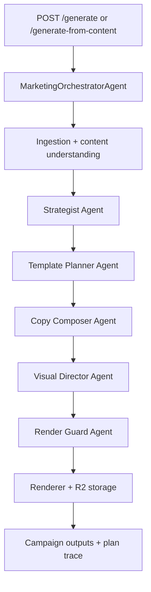

# Agentic Marketing System Design

Date: March 6, 2026

This plan supersedes the earlier no-text-AI direction.

## Goal

Upgrade the system to a Cloudflare Agents-based orchestration model that:

- accepts direct content or Ghost content
- plans platform strategy automatically
- selects templates and composes unique post variants
- chooses image strategy and prompts from central behavior policies
- enforces render-safe output (no overflow/hidden text, no incomplete truncation)
- supports markdown, math, and diagram rendering

## Platform Scope

- Instagram feed post types (portrait/square)
- Instagram carousel post type (intro/middle/ending slide strategy)
- Instagram story post type
- Facebook: reuse/adapt Instagram plan and assets
- LinkedIn: standalone post plan
- X/Twitter: standalone post plan

## Cloudflare-Native Agent Architecture

## Why Cloudflare Agents Fits

- Agents are stateful and built on Durable Objects, which fits campaign/session memory.
- Each Agent instance is globally unique and routable, allowing context continuity.
- Lifecycle hooks (`onStart`, `onRequest`, `onMessage`, `onSchedule`, `onStateUpdate`) support request, realtime, and scheduled orchestration.
- AI calls can run from agent handlers/methods via `run`, `streamText`, and `streamObject`.
- Agent + Workflow integration is designed for long-running or multi-step jobs.
- MCP client support enables tool ecosystems and external integrations.

## Central Prompt System (Core Requirement)

Use one central prompt profile that role prompts inherit from:

1. `mastermind` (global policy + marketing objective)
2. `strategist` (platform mix, funnel intent, post count planning)
3. `template_planner` (template semantics and slot constraints)
4. `copywriter` (platform-native copy generation)
5. `visual_director` (image strategy and no-text image policy)
6. `render_guard` (fit, completeness, markdown/math/diagram validation)

Request-level prompt customization should reference a `promptProfile` key instead of passing large ad hoc prompts.

## Content and Quality Guardrails

### Text in AI-generated images

- default policy: no text artifacts in generated backgrounds
- enforce via prompt policy and post-check (OCR/heuristic rejection loop)

### Markdown, math, and diagrams

- markdown slots render via sanitized Markdown-to-HTML
- math expressions render via KaTeX/MathJax
- diagrams render via Mermaid-to-SVG pipeline

### Overflow and truncation safety

- pre-render text measurement by slot/container
- adaptive font and layout fallback policy
- sentence-boundary completion checks to avoid mid-phrase cutoffs
- last-resort template switch when content cannot fit safely

## Proposed Agent Output Contract

Each generated post should include:

- platform + post_type
- selected template + required slot keys
- slot content with renderer type (`text|markdown|math|diagram`)
- caption/body copy
- image strategy (`ai|feature|custom|none`) and prompt trace
- render checks (`fit_pass`, `overflow_pass`, `completion_pass`)

## Rollout Strategy

1. Introduce central prompt registry and orchestrator shell.
2. Move existing planner/copy/image logic behind role-agent interfaces.
3. Add render guard pipeline (fit/completion checks).
4. Add markdown/math/diagram slot rendering.
5. Enable campaign planning for Instagram/Facebook/LinkedIn/X.
6. Add workflow-backed long-running execution for large campaigns.

## Sources (Cloudflare Official Docs)

- https://developers.cloudflare.com/agents/
- https://developers.cloudflare.com/agents/get-started/
- https://developers.cloudflare.com/agents/concepts/workflows/
- https://developers.cloudflare.com/agents/api-reference/agents-api/
- https://developers.cloudflare.com/agents/api-reference/using-ai-models/
- https://developers.cloudflare.com/agents/api-reference/mcp-client/
- https://developers.cloudflare.com/agents/examples/run-workflows/
